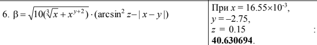
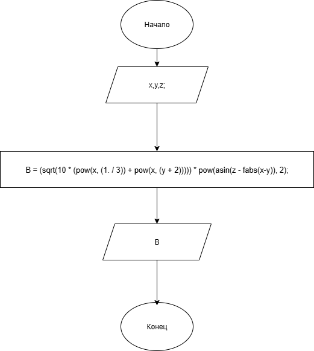

# Домашняя работа 5
## Условие задачи

### Алгоритм
1. **Начало**
2. Объявление переменных и задаем исходные числа:
   - double B, d, c
   - float x = 16.55 * pow(10, -3)
   - float y = -2.75
   - float z = 0.15
3. Bычисляем фунцию:
   - B = (sqrt(10 * (pow(x, (1. / 3)) + pow(x, (y + 2))))) * pow(asin(z - fabs(x-y)), 2)
4. Выводим результат:
   - В
5. **Конец**
### Блок-схема

(https://viewer.diagrams.net/?tags=%7B%7D&lightbox=1&highlight=0000ff&edit=_blank&layers=1&nav=1&title=5.png&dark=auto#R%3Cmxfile%3E%3Cdiagram%20name%3D%22%D0%A1%D1%82%D1%80%D0%B0%D0%BD%D0%B8%D1%86%D0%B0%20%E2%80%94%201%22%20id%3D%22gTO_w2WN4gb_tNeTqwyt%22%3E5Vltc9o4EP41zEBn6PgFDHwML2nmLu31js7dZ2EvthrZcmXxll%2FflSVjDIamTtLeBD4YabW7Wq2efSRDy53E2w%2BCpNFHHgBrOVawbbnTluPYPcfDLyXZaclg1NeCUNDAKJWCOX0EI7SMdEUDyCqKknMmaVoV%2BjxJwJcVGRGCb6pqS86qs6YkhBPB3CfsVPofDWSkpUNnUMrvgIZRMbPtjfRITApls5IsIgHfHIjcWcudCM6lbsXbCTCVvCIv2u72zOg%2BMAGJfIrBPQkE%2B1tM%2F%2F3DjV1%2FMl2Ooq9dR3tZE7YyC245HkN%2F4yVHtxi13JlUeN9WKtTxGoSkmKAuYTRMWu6NmiOJQFA1WuqpTaeiYkpWkh8qeKH5%2FtUzTq3W6EY9x7P8Oc2f%2FdbUbg29Ih5MpQ6pGuaJ2KkE7WDWEZzYGW8iKmGeEl%2BNbLA%2BUBbJmGHP3luqxcH27J7ae6RgiQGPQYodqhiDnmfAZarLK%2FqbEqt2AcDoAKdDIyOmPMK96xJB2DAg%2BglAuTWAOk5QgBVmulzIiIc8IWxWSseCr5IA1DQW9kqde85Tk7yvIOXO0EW%2ByTWpVRNdTizGxVfChwsL6hnSISIEeUHPq98oAYxIuq7G8eJZ751mXUFcw9rKYT0o2vgcG%2Bj%2Fn6Br%2F3boelfKhQgOPJMnmMDJ4yWeexr94TGXqiYigTAGjIeCxKiYYoi4TyCOxz6XAz%2BC3ZJuobgjvBQM3X4Fhs6gBoaDGhh6rwXDwVtj0OEzmdGYfuY0rwmzcX3n%2BOjrV11oxjZWR3uyD6P5Ng2vky2uYMafZsDr4stq2fXdGr4c%2Fkq%2BHL01vixefX945XwusT4r7UWUNQSYpSSpLVVVCN0liSnb6TrtkjRl0M12mYQY7x8oGjOaPHwk%2FjyX3ealo%2BT%2F8AVX1ara6JHECuvG7x2wNSgSwLFPgOEcjWurD5DAmtR7%2BJT7tuYkyfDrRsSQULWIOj%2BXbceQhMhETUwnSFr8Ac6Ef9l2iktLSEhEo5lnMqI8pX4TW0SeCBsm6w4WAjZNLP8kSUIC0sg0ipE8GxjeE97E7K8sJsmuUahfVK00MgS2CleNLCNyBkKILcJ08wuJeGxKCY%2BTAKGnOxk66WZ4Qi31iZtXfJaTpqp32023eoAhm4LoIlX4NAkNG1jvrZFdaOAZJQ%2FPdAZLc4znp15uCl2fM0byd1alkwrAyRX1Kb0F8R%2FCnNmVGhdaR4SLttPv63gPG52j68JV3XisXM1qZ9%2BEbCtut96pbso37a3OUNt%2Bn4PnFp9up5O3leGhym4vdTrqY9woFZLRpP2odlnBgiyy9ra7Uxp59jvPuV%2Fp8%2BbM%2Fap6sr%2F%2B7xrO0e8aPfv0gtSv%2B13j1S5Itv3WbkjeEy9ItlW%2FVS%2F86rm%2FExcu9AIavHpit%2FxDQKuXf6u4s%2B8%3D%3C%2Fdiagram%3E%3C%2Fmxfile%3E)
